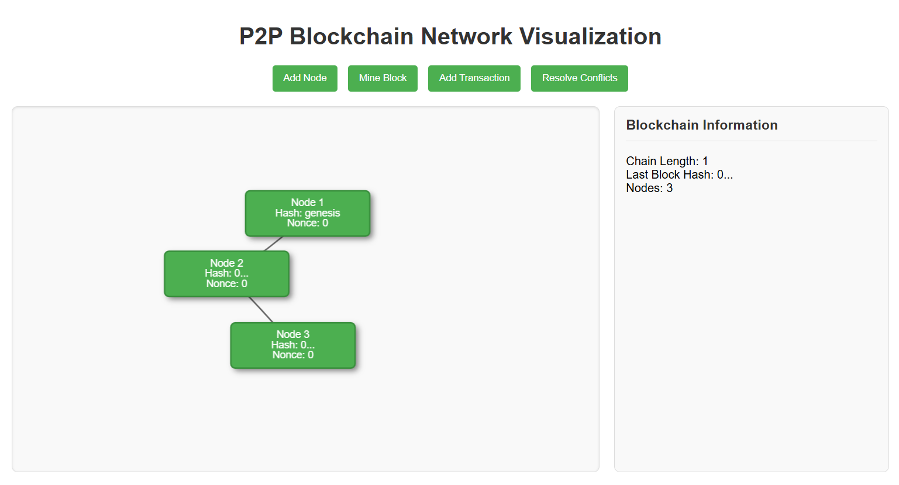
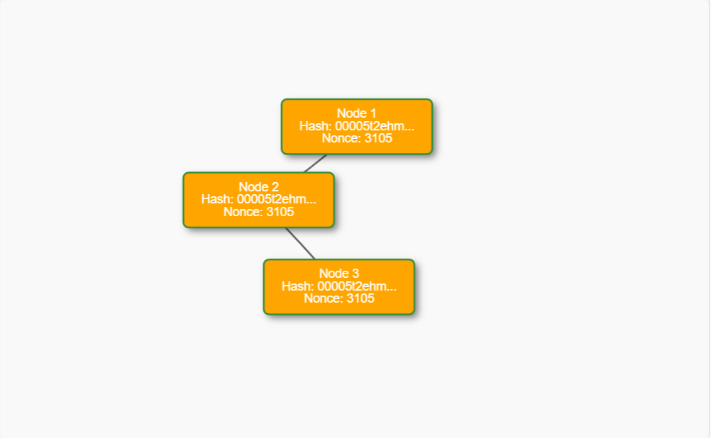
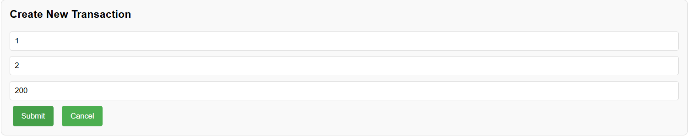
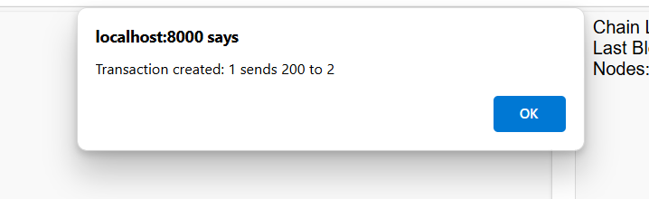

# P2P Blockchain Network Visualization


A complete visualization of a peer-to-peer blockchain network demonstrating node connections, block mining, transactions, and consensus mechanisms.

## Features

- 🟦 **Rectangular Node Visualization** - Each node displays its blockchain data
- ⛓️ **Blockchain Data Display** - View hash, nonce, and transactions for each block
- ➕ **Interactive Node Management** - Add new nodes with one click
- ⛏️ **Block Mining Simulation** - Visual Proof-of-Work demonstration
- 💰 **Transaction System** - Create and broadcast transactions
- 🔄 **Consensus Visualization** - See conflict resolution in action
- 🎨 **Visual State Changes** - Color-coded node states (mining, resolving)

## Prerequisites

- Python 3.7+
- Node.js (for package management)
- VS Code (recommended)

## Installation

1. Clone the repository:
   ```bash
   git clone https://github.com/your-username/p2p-blockchain-visualization.git
   cd p2p-blockchain-visualization
Set up Python environment:

bash
python -m venv venv
# Windows:
.\venv\Scripts\activate
# Mac/Linux:
source venv/bin/activate
Install dependencies:

bash
pip install -r backend/requirements.txt
Set up visualization library:

bash
cd frontend
mkdir -p lib
curl https://unpkg.com/vis-network@latest/dist/vis-network.min.js -o lib/vis-network.min.js
cd ..
Running the Project
bash
python app.py
Then open your browser to:

text
http://localhost:8000
How to Use
Add Nodes: Click "Add Node" to grow your network

Create Transactions:

Click "Add Transaction"

Enter sender, recipient, and amount

Submit to broadcast

Mine Blocks: Click "Mine Block" to add blocks to the chain

Resolve Conflicts: Click "Resolve Conflicts" to sync nodes

Project Structure
text
/p2p-blockchain-sim
├── /backend
│   ├── blockchain.py    # Core blockchain logic
│   ├── node.py          # Flask server implementation
│   ├── network.py       # P2P network handling
│   └── requirements.txt
├── /frontend
│   ├── index.html       # Main interface
│   ├── style.css        # Visualization styles
│   ├── script.js        # Interactive logic
│   └── /lib             # Visualization library
├── app.py               # Application entry point
└── README.md            # This file
Customization Options
In script.js:
-Adjust widthConstraint to change node sizes
-Modify colors in the options object
-Change mining difficulty in the mock mining function
In style.css:
-Update color scheme in .node-mining, .node-resolving classes
-Adjust network container dimensions
Troubleshooting
-Issue: Nodes not displaying properly
 Fix: Ensure vis-network.min.js is in /frontend/lib
-Issue: Python import errors
 Fix: Verify virtual environment is activated
-Issue: Port conflicts
 Solution: Change ports in app.py

Credits
-Built with:
-Flask - Python backend
-vis.js - Network visualization
-Python standard libraries
Screenshorts:-

Adding nodes 

mining the node

transaction dash board 

Broadcasding trasaction

License
-MIT License - See LICENSE for details
**Important notes after pasting:**
1. Replace `https://github.com/your-username/...` with your actual GitHub repo URL
2. Add a screenshot named `network-screenshot.png` in an `images` folder
3. Create a `LICENSE` file if you want to include the MIT license
4. The markdown formatting (headers, lists, code blocks) will render properly on GitHub

This gives you a professional, well-structured README that covers all aspects of your project. Just paste this as-is into your empty `README.md` file and make those minor adjustments.